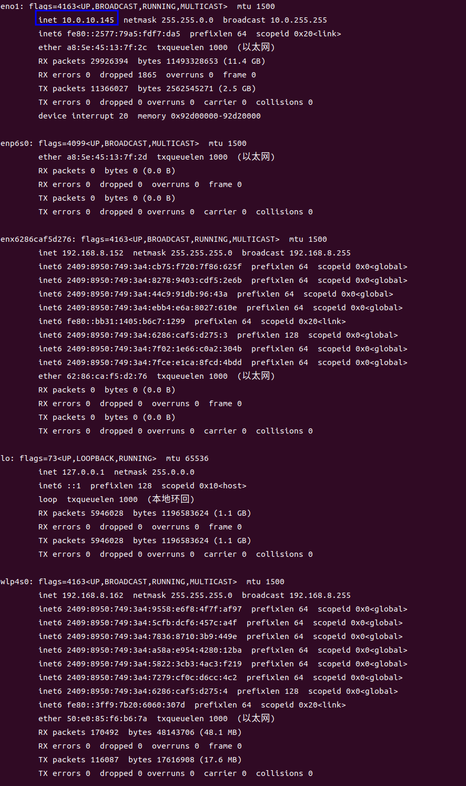
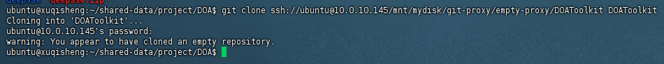

# github-本地-内网服务器连通方案

## github端操作
1. 在 GitHub 创建一个空仓库，内容为空即可
2. 得到仓库地址，例如：
```scss
git@github.com:yourname/projectA.git
```

## 本地操作步骤
1. 本地创建中转裸仓库
```bash
mkdir ~/git-proxy/A.git
```

2. 初始化空的git仓库
```bash
cd ~/git-proxy/A.git
git init --bare
```

该中转仓库类似于：
```
~/git-proxy/A.git   ← 所有推送/拉取都用它
```


## 案例
1. 在github创建仓库与得到仓库地址：
```bash
git remote add origin git@github.com:chessxu/DOAToolkit.git
git push -u origin main
```
2. 本地创建中转裸仓库
```bash
cd /mnt/mydisk/git-proxy/empty-proxy
mkdir DOAToolkit  # 空目录
```
3. 初始化空的git仓库
```bash
cd DOAToolkit
git init --bare
```
执行完毕，得到如下目录结构：


4. 本地中转仓库绑定 GitHub
```bash
git remote add origin git@github.com:chessxu/DOAToolkit.git
```

5. 设置自动转发到 GitHub
```bash
cd /mnt/mydisk/git-proxy/empty-proxy/DOAToolkit/hooks
nano post-receive
```
内容：
```bash
#!/bin/bash
# 接收到服务器的push后自动推送到 GitHub
git push --mirror origin
```
授权：
```bash
chmod +x post-receive
```

6. 服务器端克隆中转仓库
服务器和本地通过网线连接，查看本地ip地址：
```bash
ifconfig
```
结果如下：


得到本地ip地址为`10.0.10.145`

服务器执行：
```bash
git clone ssh://ubuntu@10.0.10.145/mnt/mydisk/git-proxy/empty-proxy/DOAToolkit DOAToolkit
```
运行过程：



进入项目
```bash
cd DOAToolkit
```

现在服务器的 remote origin 就指向本地中转站。

7. 服务器更新 → 自动上传 GitHub
```bash
cd DOAToolkit
echo "hello from server" > server.txt
git add .
git commit -m "server update"
git push
```

发生的链路为：
```bash
服务器 push → 本地裸仓库
本地裸仓库 hook 自动 push → GitHub
```

8. 本地开发环境直接clone GitHub（正常使用）

本地电脑另外再 clone 一份工作副本：
```bash
cd /mnt/mydisk/git-proxy/work
git clone git@github.com:chessxu/DOAToolkit.git
```
之后的日常开发都在这里进行，不会跟“中转裸仓库”冲突。

如果服务器进行了更新，本地工作目录，执行下列命令即可同步：
```bash
git pull
```

9. 本地更新，上传代码到GitHub，并实现服务器能拉取最新代码

在本地工作目录添加两个 push URL（保留 fetch 指向 GitHub）：
```bash
# 保留 origin fetch = GitHub
git remote set-url origin git@github.com:chessxu/DOAToolkit.git

# 增加两个 push URL：先 GitHub，再本地mirror（顺序无关）
git remote set-url --add --push origin git@github.com:chessxu/DOAToolkit.git
git remote set-url --add --push origin /mnt/mydisk/git-proxy/empty-proxy/DOAToolkit
```

检查push url：
```bash
git remote get-url --all --push origin
```
预期输出：
```bash
/mnt/mydisk/git-proxy/empty-proxy/DOAToolkit
git@github.com:chessxu/DOAToolkit.git
```

此时，本地有更新，push到GitHub之后，会自动向本地中转仓库也发送一份同步，那么在服务器上执行git pull，即可通过本地中转仓库去GitHub拉取最新代码了。